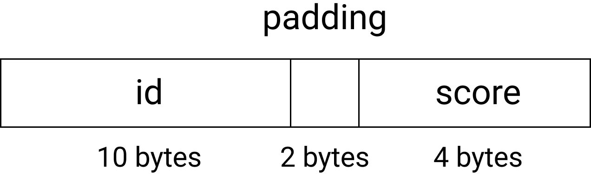

---


layout: post


title: Procedural Programming [C] - Structures


date: 2019-11-06 00:09:00 -0700


description: You’ll find this post in your _posts directory. Go ahead and edit it and re-build the site to see your changes. # Add post description (optional)


img: # Add image post (optional)


tags:  # add tag

---

# Structures

-   these allow us to pack data of different types together


ex.

```c
struct grade { /* structure declaration */
  char id[10];    /* This creates a new type called */	int score;      /* struct grade */  
};
struct grade g; 
/* struct grade: type, g: variable name */
g.score = 75;
strcpy(g.id, "a12345678"); 
/* note that you can't assign a string to g.id directly. */
struct grade c2510[90]; /* array of structures */
strcpy(c2510[0].id, "a66666666");
c2510[0].score = 5;
c2510[1] = g;

struct grade *p;	
p = &g;
(*p).score = 85; /* a -> b ≣ (*a).b */
p -> score
```


### What can we say about the size of a structure?

ex. what is `sizeof (struct grade)`? >= 14 bytes

-   In general, the size of a structure is bigger than or equal to the sum of the sizes of its members.

-   The compiler is allowed to add padding between members and at the end of a structure due to alignment requirements (if you align elements to the odd-# or multiple-of-4 addresses, it could be faster for cpu to reach to the addresses in some architectures).

-   

    ##### Possible layout of struct grade in memory



(assuming alignment at 4-bytes in boundary)


### Nested structure

ex.

```c
struct name {
	char first[20];
	char last[20];
};
struct record {
	char id[10];
	char name name; /* nested structure */
	int score;
};
struct record a[25], *p;
strcpy(a[0].id, "a66666666");
strcpy(a[0].name.first, "homer");
strcpy(a[0].name.last, "simpson");
a[0].score = 25;
p = a; /* or p = &a[0]; */
printf("%s %s %s %d", p -> id, 				p -> name.first,
       								p -> name.last, p -> score)

```


## Initialization of Sturctures

```c
struct name {
	char first[20];
	char last[20];
};
struct record {
	char id[10];
	char name name; /* nested structure */
	int score;
};

struct name n = {"homers", "simpson"};
struct record r = {"a66666666", {"homer", "simpson"}, 25}; 
/* only works for initialization */

struct record a[] = {
  {"a12345678", {"monty", "burns"}, 99}, 
  {"a11111111", {"nec", "flanders"}, 100}
};

```


### typedef — used to give a type another name

-   used to give a type another name

    ##### Example

    ```c
    typedef int integer; /* integer is the same type as int */
    ```

-   If we want to give a type another name, declare a variable of that type and then put the keyword `typedef` in front. Then the original variable name becomes the raw name for the type.

    ##### Example

    ```c
    				int n; /* n: a variable name */
    typedef int n; /* n: another name for the int type */
    /* after this typedef, n a; creates a variable of type int */
    
    typedef struct name name;
    name n, a[90];
    ```

    

    ##### Example. Give the type *array of 25 ints* the name *set*

    ```c
    typedef int set[25];
    set A, B, C, D;
    ```


-   ​	We can use the typedef with the structure declaration :

    ```c
    typedef struct name {
    	char first[20];
      char last[20];
    } name;
    
    name n;
    
    /* declaring the structure & creating variables at the same time */
    struct name {
      char first[20];
      char last[20]; 
    } n, a[10], *p;
    /* n: variable of type struct name */
    ```


```c
/* ############## <struct_pointer.c> ############## */
#include <stdio.h>
#define NAMESIZE 20
#define IDSIZE   10

typedef struct name name;

struct name {
    char first[NAMESIZE];
    char last[NAMESIZE];
};

typedef struct record record;

struct record {
    char id[IDSIZE];
    name name;
    int score;
};

void print_record(record *r) {
    printf("%s : %s %s : %d\n", r->id, r->name.first, r->name.last, r->score);
}
int main(void) {
    record a[] = {{"a12345678", {"homer", "simpson"}, 25},
                  {"a11111111", {"monty", "burns"}, 99}
                 };
    size_t i;
    for (i = 0; i < sizeof(a) / sizeof(a[0]); i++) {
        print_record(&a[i]);
    }

    return 0;
}
```

