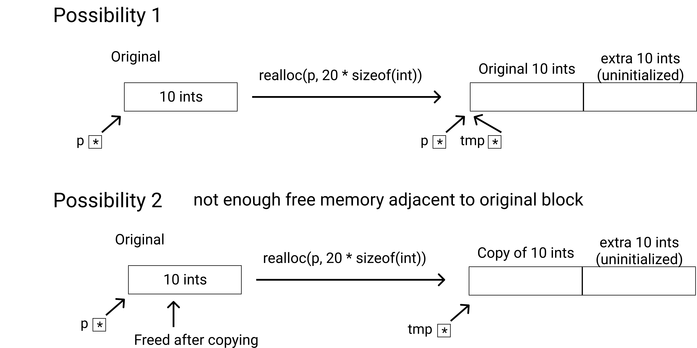
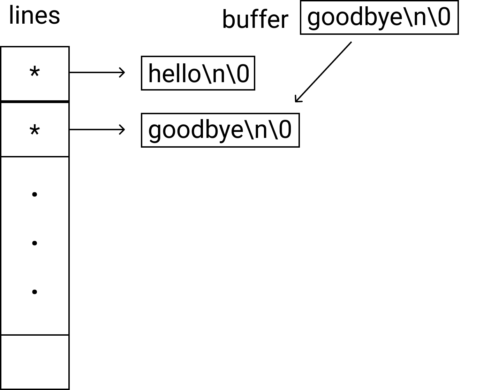
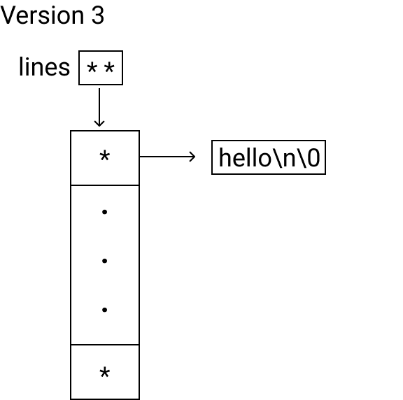

---


layout: post


title: Procedural Programming [C] - Memory Management


date: 2019-11-06 00:09:00 -0700


description: You’ll find this post in your _posts directory. Go ahead and edit it and re-build the site to see your changes. # Add post description (optional)


img: # Add image post (optional)


tags:  # add tag

---


##  Table of Contents

[TOC]

# Chapter 12. Memory Management 

-   in the textbook "C Primer Plus", p.511–564 

## Void pointer

```c
int * p; // int: destination type / target type

void *q; /* a void pointer can point to any type of object */
int n = 123;  double x = 1.23;
q = &n; /* OK */
q = &x; /* OK */
*q = 3.14; /* invalid; cannot dereference a void * */
* (double *) q = 3.14; /* OK */
```

-   A void pointer can point to any type of object
-   A void pointer connot be directly dereferenced

```c
int n = 123;
void *p = *n;
int *q = p;
*q = 456 /* changes n to 456 */
```

-   A void pointer is compatible with any other type of pointer to object

    e.g. `p = q; (void * = int *)` `q = p; (int * = void *)` 


## Lifetime of objects

-   Right now, we have 2 kinds of objects - local vs. global (a.k.a external)

```c
example)
int n; /* external object; lifetime is duration of program */
int main(void) {
	int x = 1; /* local to main */
	.....
	if(x == 1) {
		int y = 2; /* local to if */
		.....
		.....
	} /* y destroyed here */
	.....
	return 0;
} /* * destroyed here */
```

-   Lifetime of a local object is the duration of execution of the block in which it is created. 
-   Lifetime of an external(global) object is the duration of the program. 
-   **Uninitialized local variables have random(garbage) values**
-   **However, uninitialized external variables contain 0's.**


## Dynamic Memory

-   Gives us more control over the lifetime of an object (we can create an object at any time and destroy it at any later time)

```c
#include <stdlib.h>
malloc // for allocating dynamic memory
calloc //        (same as above)
realloc // typically used to resize dynamic memory
free // for deallocating dynamic memory
```


### malloc()

Example: allocating dynamic memory for IO ints

```c
int *p;
p = malloc(10 * sizeof(int));
if(p == 0) { /* when malloc() returns null pointer (0) */ 
  fprintf(stderr, "unable to allocate memory \n");
	exit(1); /* error code: 1 */ 
}
/* use the array of 10 ints */
p[0] = p[2] = p[4] = p[6] = p[8] = 0; /* dynamic array */
p[1] = p[3] = p[5] = p[7] = p[9] = 1;
/* deallocate memory when done */
free(p);
```

-   What if we need to allocate a dynamic array of 10 doubles?

```c
double *p = malloc(10 * sizeof(double));
```

-   What is the return type of malloc()? 

```c
// prototype //
void * malloc(size_t){} 
/* this is why we had to talk about void pointer!! */
/* malloc returns object pointer that can be used for any object type */
```

-   **`malloc()` returns the starting addrress of the block memory it allocates or the null pointer of failure**

-   **memory allocated by malloc contains random values** - different than calloc


### calloc() - almost the same as malloc() except

1.  it zeros out the allocated memory (i.e. allocated memory contains 0's)

2.  calloc takes 2 arguments — the no. of objects and the size of each objecct

    `int *p = calloc(10, size(int));`

```c
// prototype //
void * calloc(size_t, size_t){} 
```


### realloc() - change size of the allocated memory

```c
// prototype //
void * realloc(void *p, size_t, newsize);
/* p = pointer to original block */

```


-   2 special cases:

    ```c
    realloc(p, 0) ≣ free(p)
    realloc(0, size) ≣ malloc(size)
    
    ```

ex. 

```c
int *p, *tmp;
if((p = malloc(10 * sizeof(int))) == 0) {
	fprintf(stderr, "...");
  exit(1);
}
/* use the 10 ints */
/* Assume 10 ints is not enough; resize to 20 ints */
if((tmp = realloc(p, 20 * sizeof(int))) == 0) {
  fprintf(stderr, "unable to resize memory \n");
} else {
  p = tmp; /* p now points to a block of 20 ints with the original 10 ints */
}
/* free memory when done */
free(p);

```


-   Assuming realloc succeeds, there are still 2 possibilities: 




-   Dynamic memory is allocated on the heap


### **figure... add it later**


## Examples: storing lines of texts

### Version 1.

```c
#define LINESIZE 100
#define NLINES 10000

char lines[NLINES][LINESIZE]; /* 20 array: lines is an array
																	of NLINES objects each an array
                                  of LINESIZE chars */
size_t i, j;
for (i = 0; i < NLINES; i++) {
  if(!fgets(lines[i], LINESIZE, stdin))
    break; /* if you can't read a line, break */
}

/* example: print back the lines */
for (j = 0; j < i; j++) 
  printf("%s", lines[j]);

```

-   Disadvantage: not flexible; may be wasting memory


### Version 2. 

-   Maximum number of lines is still fixed

-   but each line is dynamically–allocated + just fits the input line

    




```c
#define NLINES 10000
#define BUFSIZE 1024

char *lines[NLINES];
char buffer[BUFSIZE];
size_t i, j;

for(i = 0; i < NLINES; i++) {
  if(!fgets(buffer, BUFSIZE, stdin))
    break;
  lines[i] = malloc(strlen(buffer) + 1); /* +1 for nulll char */
  if(lines[i] == 0) {
    fprintf(stderr, "malloc failed\n");
    break;
  }
  strcpy(lines[i], buffer);
}

/* example: print back the lines */
for(j = 0; j < i; j++) {
  printf("%s", lines[j]);
}

/* deallocate memory when done */
for (j = 0; j < i; j++)
  free(lines[j]);


```


### Version 3

-   Remove the restriction to at most NLINES lines

    

    

    

```c
#define BUFSIZE 1024
#define BLOCK 10
char **lines;
char buffer[BUFSIZE];
size_t nalloc, nused;

lines = 0; /* initializing lines as a null pointer */
nalloc = nused = 0;

/* as long as we can read a line */
while(fgets(buffer, BUFSIZE, stdin)) {
  
	/* if we have used up the allocated pointers */
  if(nused == nalloc) {
    
    /* add BLOCK more pointers */
    char ** tmp = realloc(lines, (nalloc + BLOCK) * sizeof(char*)); 
    if(temp == 0) {
      fprintf(stderr, "realloc failed\n");
      break;
    }
    lines = tmp;
    nalloc += BLOCK;
  }
  
  /* there are unused pointers */
  lines[nused] = malloc(strlen(buffer) + 1);
  if(lines[nused] == 0) {
    fprintf(stderr, "malloc failed\n");
    break;
  }
  strcpy(lines[nused++], buffer);
}

/* example: printing back the lines */
for (i = 0; i < nused; i++){
  printf("%s", lines[i]);
}

/* deallocate memory when done */
for (i = 0; i < nused; i++)
  free(lines[i]);
free(lines);


```

